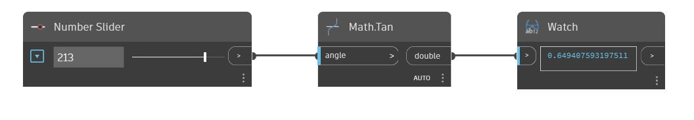

## Em profundidade
Tan retornará a tangente de um ângulo de entrada em graus. No exemplo abaixo, usamos um controle deslizante de número definido para o intervalo de -360 a 360 para controlar o ângulo de entrada para um nó Tan.
___
## Arquivo de exemplo

