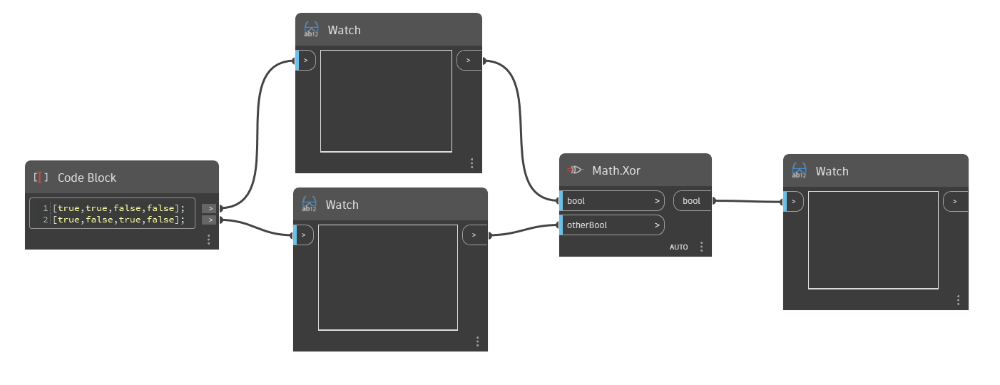

## Em profundidade
`Math.Xor` aceita dois valores booleanos, ou duas listas de valores booleanos, e determina se os valores são iguais ou diferentes. `Math.Xor` comparará os valores de entrada e retornará True se exatamente uma das entradas for True. Se ambos os valores forem True ou se ambos os valores forem False, `Math.Xor` retornará False.

No exemplo abaixo, começamos com duas listas de valores booleanos. Juntas, essas listas representam as quatro combinações possíveis de valores True e False. Observe que, diferentemente dos nós `And` e `Or`, `Math.Xor` permite apenas dois valores.
___
## Arquivo de exemplo

