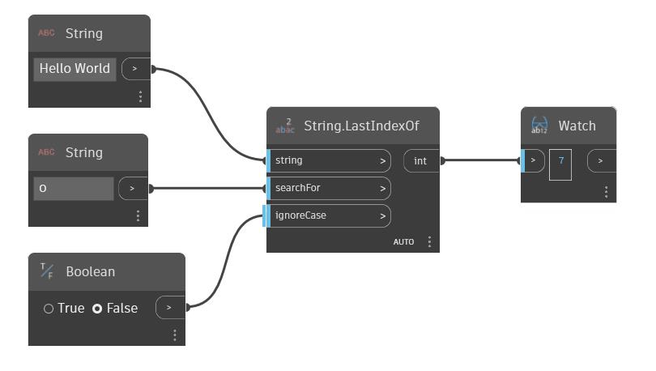

## Em profundidade
Last Index Of pesquisará uma determinada sequência em busca de uma segunda sequência de caracteres. Se a segunda sequência de caracteres for encontrada, esse nó retornará o índice da última ocorrência. Por padrão, esse nó distingue maiúsculas de minúsculas. É possível usar um valor booleano na entrada `ignoreCase` para fazer com que o nó ignore as maiúsculas e minúsculas das sequências de caracteres. No exemplo abaixo, usamos a sequência “Hello World” e pesquisamos a sequência de caracteres “o”. Essa sequência de caracteres é encontrada duas vezes dentro da sequência de caracteres base e o índice da ocorrência final da sequência de caracteres é retornado.
___
## Arquivo de exemplo

