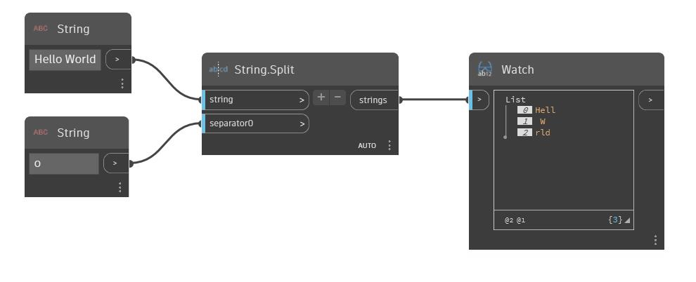

## Em profundidade
O nó Geometry Split funciona de forma semelhante ao nó Geometry Trim. Ele insere uma ferramenta – qualquer tipo de geometria com a qual você aparará outra geometria – e uma geometria, e retorna todos os fragmentos da geometria. Neste exemplo, um cone é dividido com um cone semelhante. Embora todos os fragmentos sejam retornados pelo nó Geometry Split, um é visualizado no arquivo de exemplo.
___
## Arquivo de exemplo

