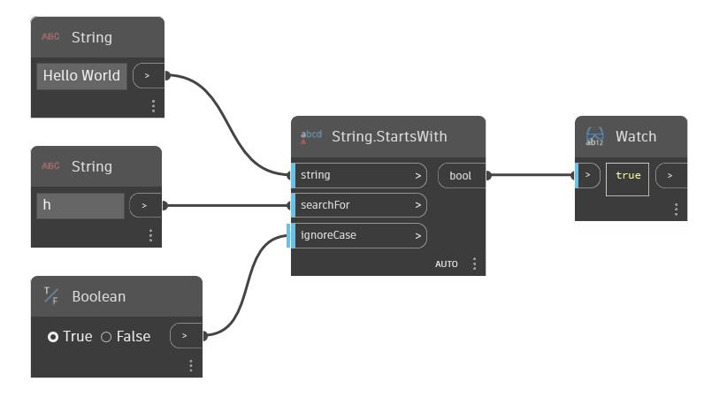

## Em profundidade
Starts With retornará um valor booleano baseado no fato de uma determinada sequência de caracteres começar com uma segunda sequência de caracteres. Por padrão, esse nó distingue maiúsculas de minúsculas. É possível usar um valor booleano na entrada `ignoreCase` para fazer com que o nó ignore as maiúsculas e minúsculas das sequências de caracteres. No exemplo abaixo, usamos a sequência “Hello World” como sequência de caracteres original e usamos uma segunda sequência de caracteres `h` como aquela a ser pesquisada. Como “Hello World” começa com a sequência de caracteres `h` e ignoreCase está definido como True, o nó StartsWith retornará True.
___
## Arquivo de exemplo

