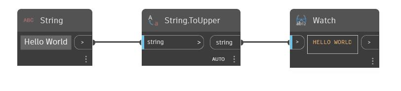

## Em profundidade
To Upper converterá uma sequência de caracteres de entrada em letras maiúsculas. No exemplo abaixo, começamos com a sequência de caracteres “Hello World”. Usando um nó ToUpper, alteramos essa sequência de caracteres para “HELLO WORLD”.
___
## Arquivo de exemplo

