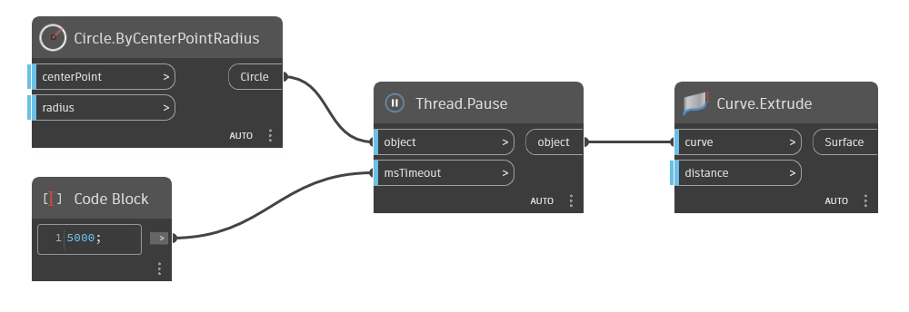

## Em profundidade
`Thread.Pause` retorna o resultado de um nó após pausar a execução do gráfico (thread) por um período de tempo especificado.

No exemplo abaixo, um círculo é extrudado em uma superfície 5 segundos após a execução do gráfico. Para usar o atraso de tempo, o modo de execução deve ser definido como Manual.
___
## Arquivo de exemplo

