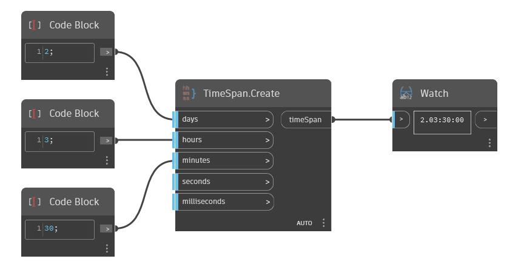

## Em profundidade
Create retornará um novo intervalo de tempo com base em dias, horas, minutos, segundos e milissegundos. No exemplo abaixo, criaremos o intervalo de tempo 2.03:30:00 ou 2 dias, 3 horas e 30 minutos.
___
## Arquivo de exemplo

