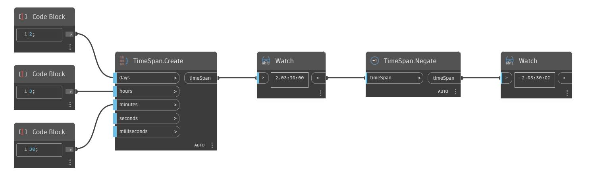

## Em profundidade
Negate retornará o negativo de um intervalo de tempo. No exemplo abaixo, um intervalo de tempo de 2 dias, 3 horas e 30 minutos é negativo (-2.03:30:00).
___
## Arquivo de exemplo

