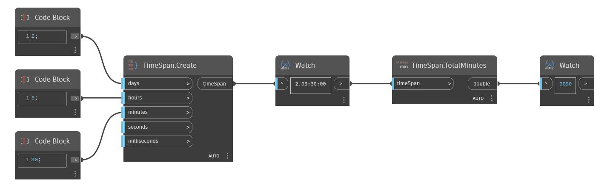

## Em profundidade
TotalMinutes retornará o número de minutos em um intervalo de tempo como um duplo. No exemplo abaixo, o número total de minutos retornado do intervalo de tempo 2.03:00:00 é 3090.
___
## Arquivo de exemplo

