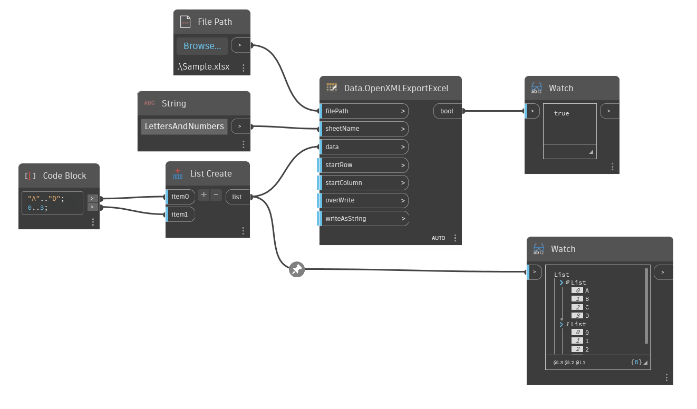

## Em profundidade
Data.OpenXMLExportExcel escreve dados no Microsoft Excel usando o padrão OpenXML. Essa versão de nós do Excel não requer que o Excel esteja instalado no computador. overWrite e writeAsString são entradas opcionais com valores padrão. Overwrite substituirá todo o conteúdo em um arquivo do Excel e writeAsString forçará todos os dados em uma representação de sequência de caracteres.
___
## Arquivo de exemplo

