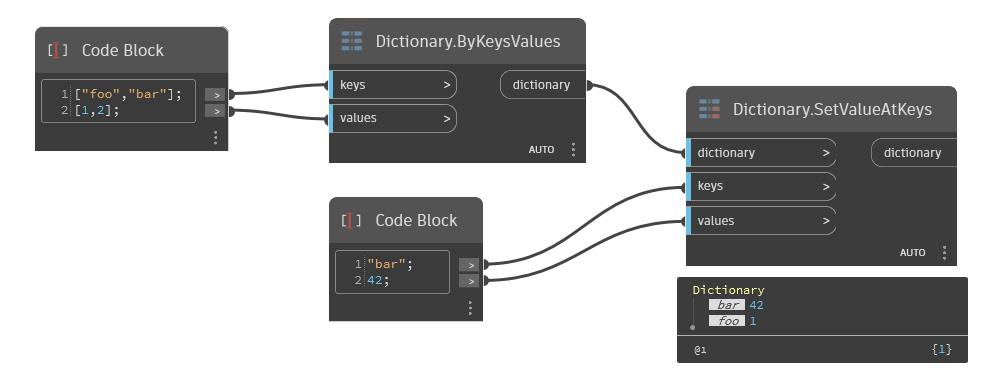

## Em profundidade
Crie um novo dicionário com uma lista de chaves definidas para os novos valores, possivelmente substituindo pares chave-valor existentes. Essas duas listas devem ter o mesmo tamanho. Caso contrário, a menor das duas delimita o número de inserções.
___
## Arquivo de exemplo

