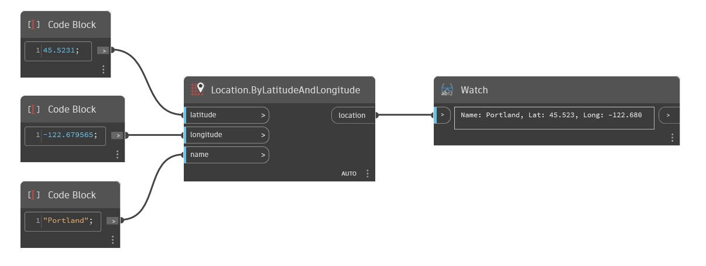

## Em profundidade
ByLatitudeAndLongitude retornará uma localização dos valores de latitude e longitude de entrada (duplos) e um nome de entrada (sequência de caracteres). No exemplo abaixo, uma localização é criada com base na latitude 45.5231, na longitude -122.679565 e em um nome: Portland.
___
## Arquivo de exemplo

