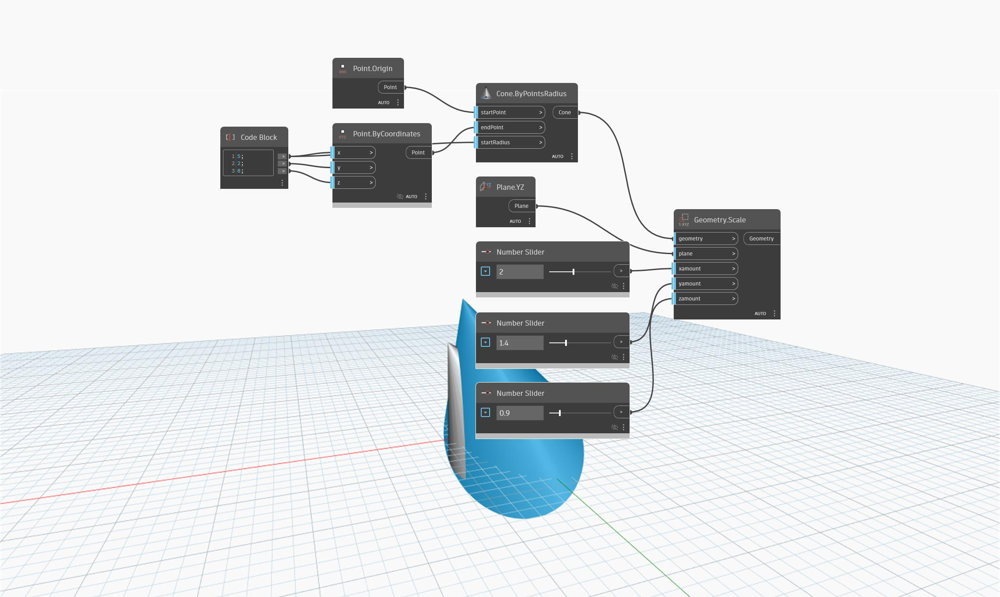

<!--- Autodesk.DesignScript.Geometry.Geometry.Scale(geometry, plane, xamount, yamount, zamount) --->
<!--- EWHQFBJJR5GL3IN7LJ7T7SOY4G24EIBASTHDIRIYQ27HIKC2MGYQ --->
## Em profundidade
`Geometry.Scale (plane, xamount, yamount, zamount)` dimensiona a geometria de entrada em torno de um plano pelos fatores X, Y e Z especificados.

O exemplo abaixo mostra um cone antes e depois de ter sido dimensionado em relação ao plano YZ.

___
## Arquivo de exemplo

