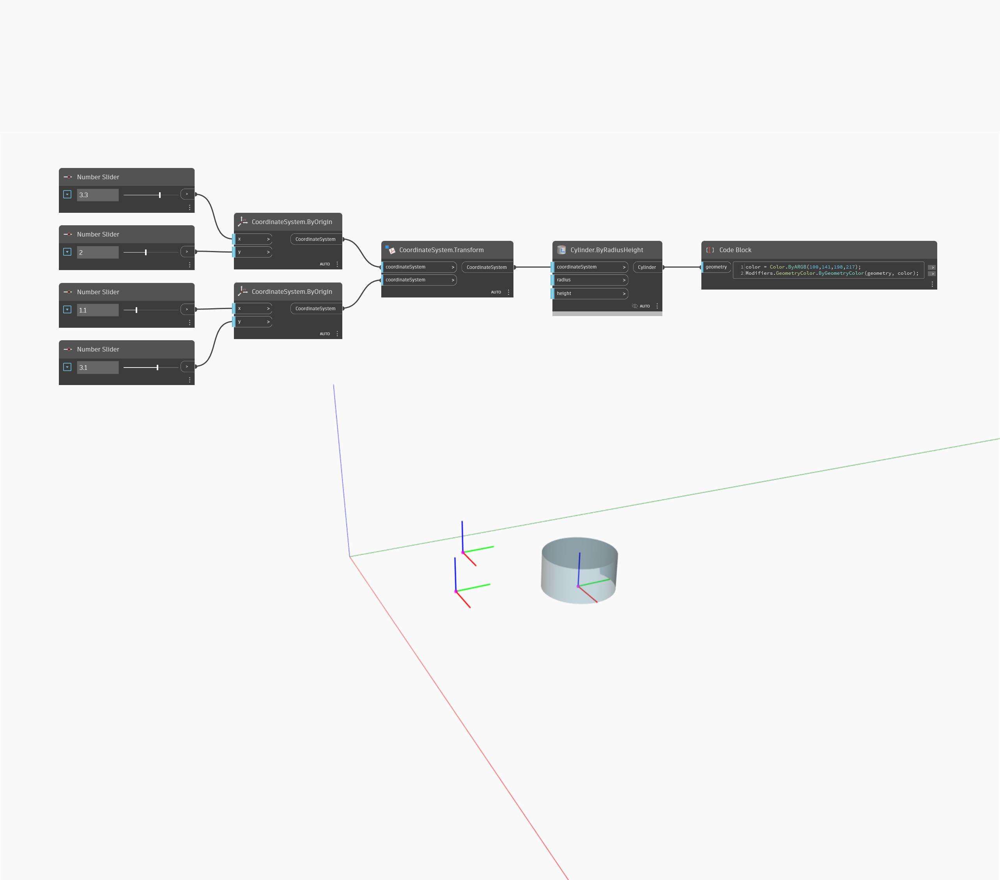

<!--- Autodesk.DesignScript.Geometry.Geometry.Transform(geometry, cs) --->
<!--- FYPDHZXND4VQKFSL7IXEWDONQWVSV7GLPRPS3VGIQTCEC2GVTC7A --->
## Em profundidade
Transforma a geometria pela transformação do CoordinateSystem fornecida.
___
## Arquivo de exemplo

