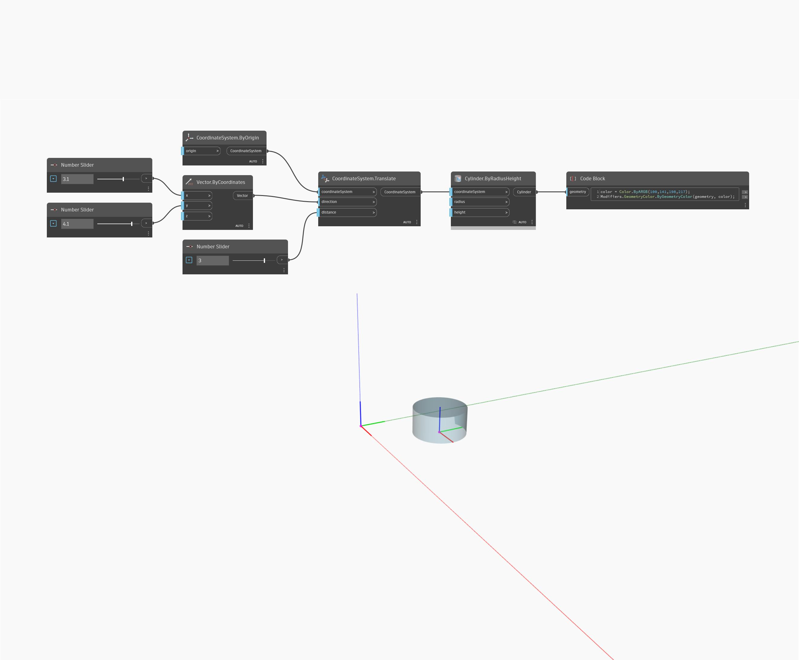

<!--- Autodesk.DesignScript.Geometry.CoordinateSystem.Translate(direction, distance) --->
<!--- G4FMYWTHURTGUOQQGRPIN6WMHT2BRYZXFVAJBYAUIIJQUAKWSY3Q --->
## Em profundidade
Converte qualquer tipo de CoordinateSystem pela distância determinada na direção determinada.
___
## Arquivo de exemplo

