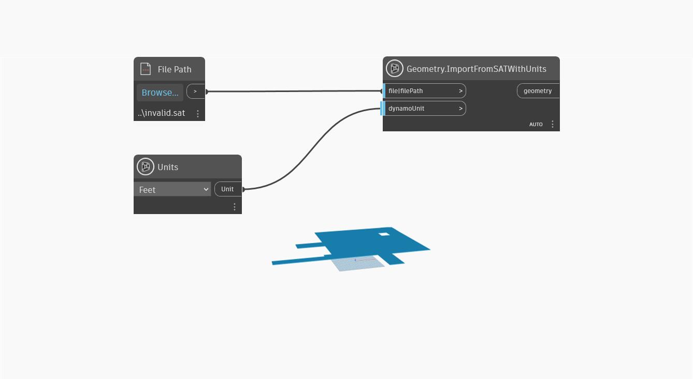

## Em profundidade
`Geometry.ImportFromSATWithUnits` importa geometria para o Dynamo de um arquivo .SAT e do `DynamoUnit.Unit` que é conversível em milímetros. Esse nó usa um objeto de arquivo ou caminho de arquivo como a primeira entrada e um `dynamoUnit` como a segunda. Se a entrada `dynamoUnit` for deixada nula, a geometria .SAT será importada como sem unidade, simplesmente importando os dados geométricos no arquivo sem qualquer conversão de unidade. Se uma unidade for aprovada, as unidades internas do arquivo .SAT serão convertidas nas unidades especificadas.

O Dynamo é sem unidades, mas os valores numéricos no gráfico do Dynamo provavelmente ainda têm alguma unidade implícita. É possível usar a entrada `dynamoUnit` para dimensionar a geometria interna do arquivo .SAT para esse sistema de unidades.

No exemplo abaixo, a geometria é importada de um arquivo .SAT, com pés como unidade. Para que esse arquivo de exemplo funcione no computador, faça o download desse arquivo SAT de exemplo e aponte o nó `File Path` para o arquivo invalid.sat.

___
## Arquivo de exemplo

