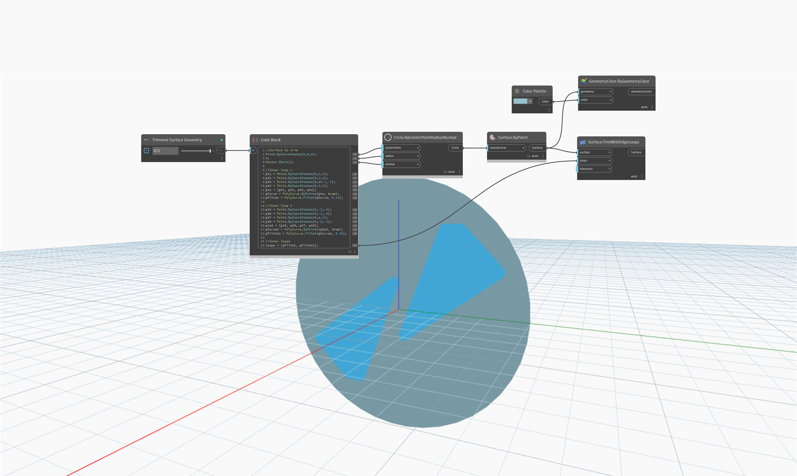

<!--- Autodesk.DesignScript.Geometry.Surface.TrimWithEdgeLoops(surface, loops, tolerance) --->
<!--- IHQBNPJ223NVYG6Y4542YTEX7XGP53QRWLFA6633XPAJMTTLNO7A --->
## Em profundidade
`Surface.TrimWithEdgeLoops` apara a superfície com uma coleção de uma ou mais PolyCurves fechadas que devem estar todas na superfície dentro da tolerância especificada. Se um ou mais furos precisarem ser cortados na superfície de entrada, deverá existir um contorno externo especificado para o limite da superfície e um contorno interno para cada furo. Se a região entre o limite da superfície e os furos precisar ser aparada, apenas o laço para cada furo deverá ser fornecido. Para uma superfície periódica sem contorno externo, como uma superfície esférica, a região aparada poderá ser controlada invertendo a direção da curva do contorno.

A tolerância é a tolerância usada ao decidir se as extremidades da curva são coincidentes e se uma curva e uma superfície são coincidentes. A tolerância fornecida não pode ser menor que qualquer uma das tolerâncias usadas na criação das PolyCurves de entrada. O valor padrão de 0,0 significa que será usada a maior tolerância usada na criação das PolyCurves de entrada.

No exemplo abaixo, dois contornos são recortados de uma superfície, retornando duas novas superfícies destacadas em azul. O controle deslizante numérico ajusta a forma das novas superfícies.

___
## Arquivo de exemplo

