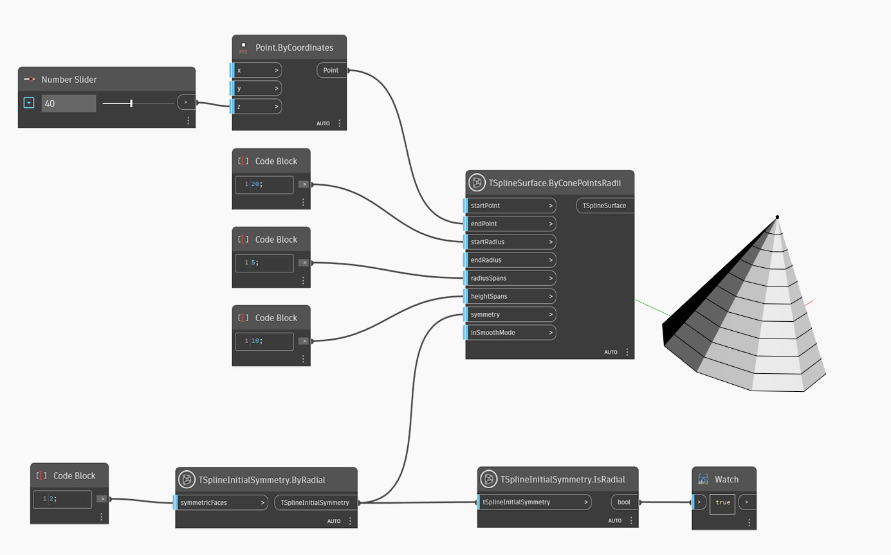

<!--- Autodesk.DesignScript.Geometry.TSpline.TSplineInitialSymmetry.IsRadial --->
<!--- KB37RARA32V2WDFDQAYZ4ZFBA3AOPWGQNDOAMYU4G6VXI5W6TR3Q --->
## In-Depth
No exemplo abaixo, o nó `TSplineInitialSymmetry.IsRadial` confirma se o tipo de simetria inicial aplicado à superfície da T-Spline é simetria radial. Se o nó retornar False, a simetria será do tipo axial.

## Arquivo de exemplo

