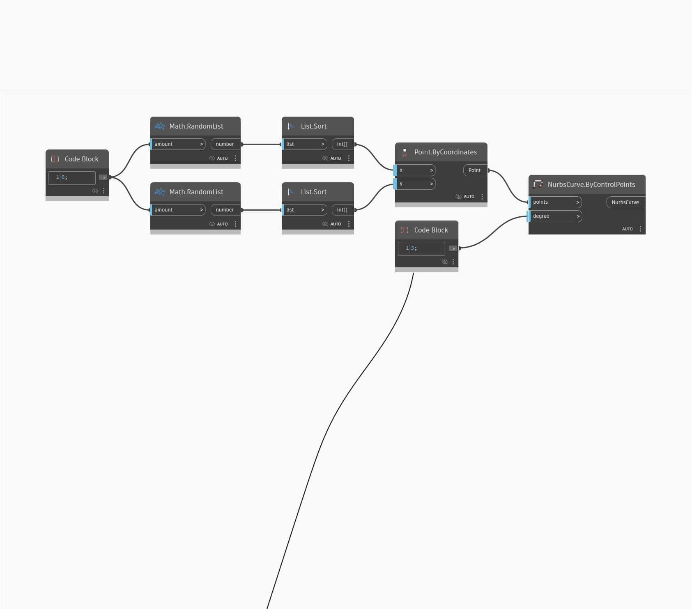

<!--- Autodesk.DesignScript.Geometry.NurbsCurve.ByControlPoints(points, degree) --->
<!--- M7MZHZHWH4ZKVKUYXLRW627FB62D73CFFTQ2Q4CDDYU24PMN4A2A --->
## Em profundidade
Nurbs Curve By Control Points insere uma lista de pontos de controle para desenhar a curva Nurbs e também permite controlar o grau da curva. Este exemplo gera quatro pontos aleatórios no plano XY universal e os conecta em ordem nas direções X e Y.
___
## Arquivo de exemplo

