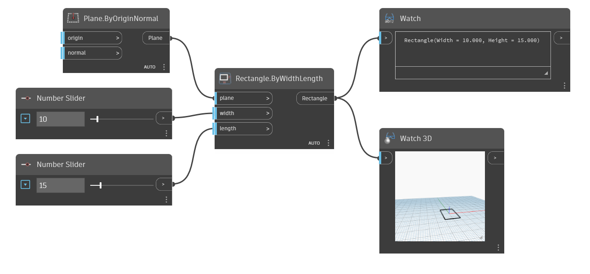

<!--- Autodesk.DesignScript.Geometry.Rectangle.ByWidthLength(plane, width, length) --->
<!--- MNNWHJCYE2KIJHONO2J56LQNPLRQZZARI7KF2BP4OJ6BRWGDXPAQ --->
## Em profundidade
Crie um retângulo centralizado na origem do plano de entrada, com largura especificada (comprimento do eixo X) e comprimento (comprimento do eixo Y). No exemplo, usamos o plano YZ universal como plano de entrada. A largura especifica o comprimento do eixo X do plano, que neste caso corresponde ao eixo Y universal, e o comprimento especifica o comprimento do eixo Y do plano, que nesse caso corresponde ao eixo Z universal.
___
## Arquivo de exemplo

