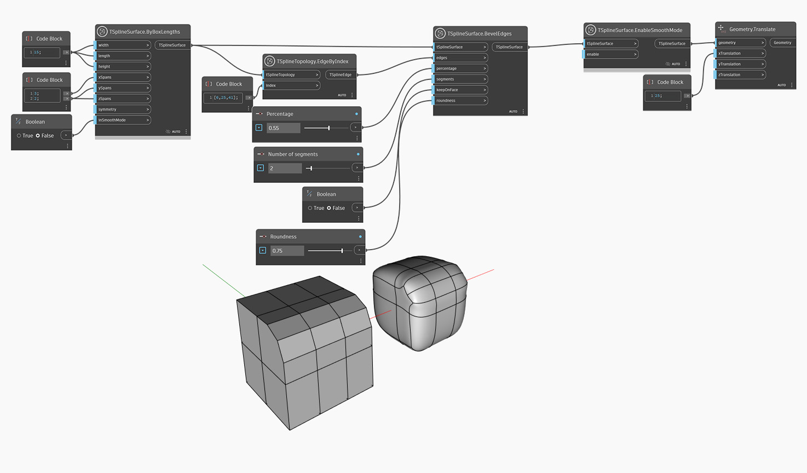

<!--- Autodesk.DesignScript.Geometry.TSpline.TSplineSurface.EnableSmoothMode --->
<!--- NN2ZH7ONXE6AF3LL2XG7BSXNABGZRF4KYTGXDYF24O5PLZ2GWW4Q --->
## Em profundidade
O modo de caixa e o modo suave são duas formas de visualizar uma superfície da T-Spline. O modo suave é a forma verdadeira de uma superfície da T-Spline e é útil para visualizar a estética e as dimensões do modelo. O modo de caixa, por outro lado, pode fornecer informações sobre a estrutura da superfície e oferecer uma melhor compreensão dela, bem como uma opção mais rápida para visualizar geometria grande ou complexa. O nó `TSplineSurface.EnableSmoothMode` permite alternar entre esses dois estados de visualização em vários estágios de desenvolvimento de geometria.

No exemplo abaixo, a operação de chanfro é executada em uma superfície de caixa da T-Spline. O resultado é visualizado primeiro no modo de caixa (a entrada `inSmoothMode` da superfície de caixa definida como false) para uma melhor compreensão da estrutura da forma. Em seguida, o modo suave é ativado através do nó `TSplineSurface.EnableSmoothMode` e o resultado é convertido à direita para visualizar ambos os modos ao mesmo tempo.
___
## Arquivo de exemplo

