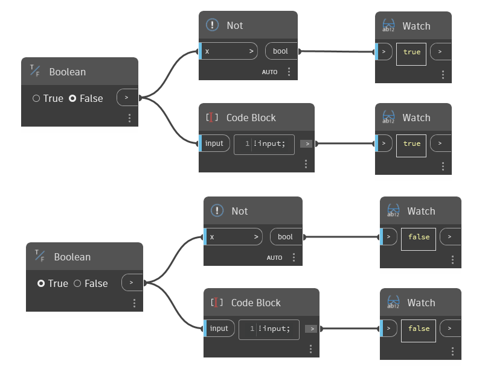

## Em profundidade
O nó `Not` retorna o oposto de um valor booleano de entrada. O nó Not também é referenciado como `!` (ponto de exclamação) no DesignScript e converterá True em False e vice-versa.

No exemplo abaixo, nós `Not` são usados para trocar entradas booleanas por seu oposto. O exemplo também ilustra o uso de um bloco de código com `!input` para reverter o valor booleano.
___
## Arquivo de exemplo

