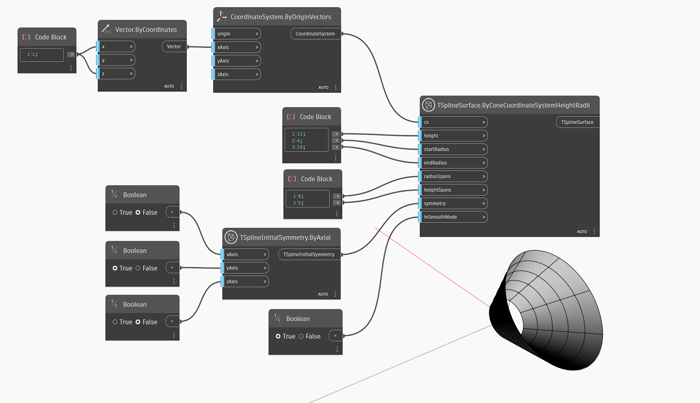

<!--- Autodesk.DesignScript.Geometry.TSpline.TSplineSurface.ByConeCoordinateSystemHeightRadii --->
<!--- O4AZYQKKSK7J5LQTW2WAZMMEFQCRSMDS5RYJ7LGVKPDRQOPRHILQ --->
## In-Depth
No exemplo abaixo, é criado um cone com sua base posicionada na origem do sistema de coordenadas, definido pela entrada `cs`. O tamanho do cone é definido por `height`, `startRadius` e `endRadius`. Os vãos nas direções radiais e de altura são controlados pelas entradas `radiusSpans` e `heightSpans`. A simetria inicial da forma é especificada pela entrada `symmetry`. Se a simetria X ou Y estiver definida como Ture, o valor dos vãos radiais deverá ser um múltiplo de 4. Por fim, a entrada `inSmoothMode` é usada para alternar entre a visualização do modo suave e de caixa da superfície da T-Spline.

## Arquivo de exemplo

