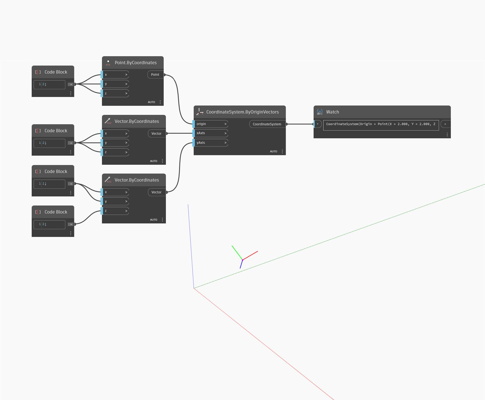

<!--- Autodesk.DesignScript.Geometry.CoordinateSystem.ByOriginVectors(origin, xAxis, yAxis) --->
<!--- OH554N4PUDZNL4VT5CUWEDPC3OHVKCDBCOPHIXQAIDMNWPFEREUQ --->
## Em profundidade
ByOriginVectors (origin, xAxis, yAxis) retornará um novo CoordinateSystem em um ponto de origem de entrada com os eixos X e Y de entrada. No exemplo abaixo, o CoordinateSystem é colocado em uma origem com novos vetores para os eixos X e Y. O resultado é um CoordinateSystem rotacionado em relação ao CoordinateSystem original.
___
## Arquivo de exemplo

