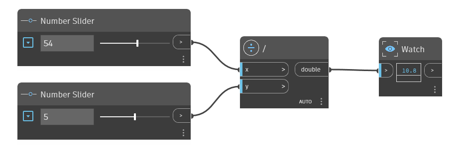

## Em profundidade
O nó `/` é o operador de divisão. Devolve o resultado da entrada `x` dividida pela entrada `y`. No exemplo abaixo, é usado um nó `/` para dividir a entrada `x` pela entrada `y`. São usados dois controles deslizantes de números para controlar as entradas para o operador `/`.
___
## Arquivo de exemplo

