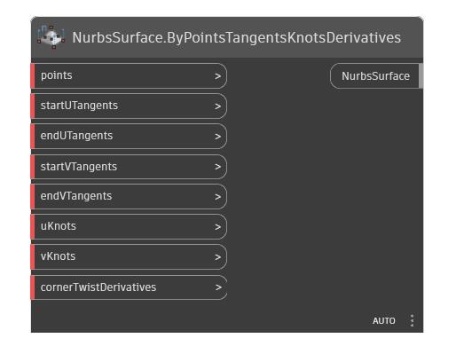

<!--- Autodesk.DesignScript.Geometry.NurbsSurface.ByPointsTangentsKnotsDerivatives --->
<!--- RV2SASIKSEDOUBHRUROUQ4CVIRQAGMTKGBFMRRLXVRULYUOVADQQ --->
## Em profundidade
Cria uma NurbsSurface que satisfaz uma coleção de diferentes características de superfície. Esse é o método de ajuste de superfície mais avançado. A superfície resultante passará através de todos os pontos. O número de tangentes deve coincidir com o número de pontos na direção correspondente. A superfície resultante será de grau 3 na direção U e V. Os derivativos de canto devem ser de segunda ordem (dP/dUdV) e devem ser fornecidos nesta ordem [ lowU, lowV ], [ highU, lowV ], [ lowU, highV ], [ highU, highV ].
___
## Arquivo de exemplo

