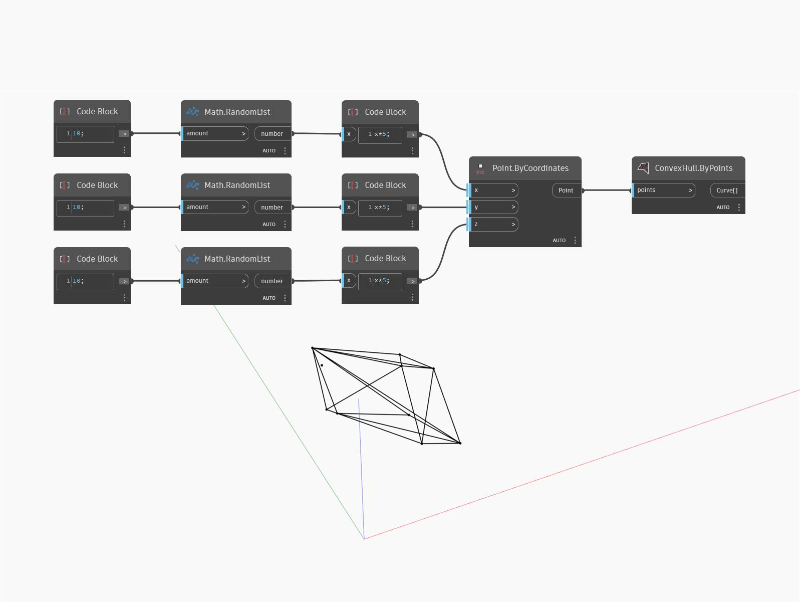

## Em profundidade
`ConvexHull.ByPoints` retorna uma lista de curvas que representam a cobertura convexa de um conjunto de pontos.

No exemplo abaixo, uma lista de pontos colocados aleatoriamente em 3D retorna uma lista de curvas representando sua cobertura convexa.

___
## Arquivo de exemplo

