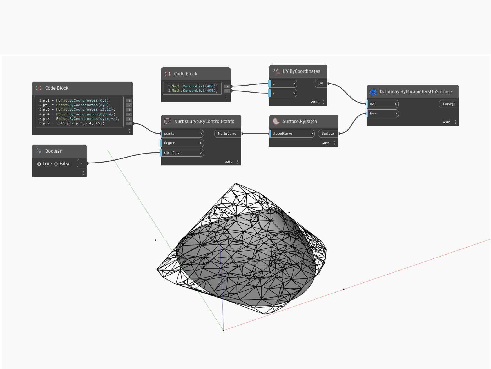

## Em profundidade
`Delaunay.ByParametersOnSurface` retorna uma triangulação de Delaunay de uma superfície de entrada.

No exemplo abaixo, uma triangulação de Delaunay de uma NurbsSurface é retornada com uma contagem de UV de 400. Aumentar a contagem de UV criará uma melhor aproximação da superfície subjacente, mas com mais triângulos.

___
## Arquivo de exemplo

