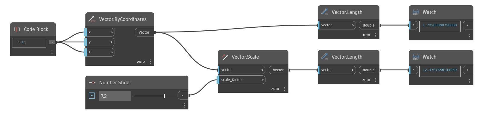

<!--- Autodesk.DesignScript.Geometry.Vector.Scale(scale_factor) --->
<!--- UNW3BJQZLUPQBNSPIOZP5QAFHL3GMBHAQBSV4IPTCMKOFUPI42NA --->
## Em profundidade
Vetor de escala de forma uniforme em torno da origem.
___
## Arquivo de exemplo

