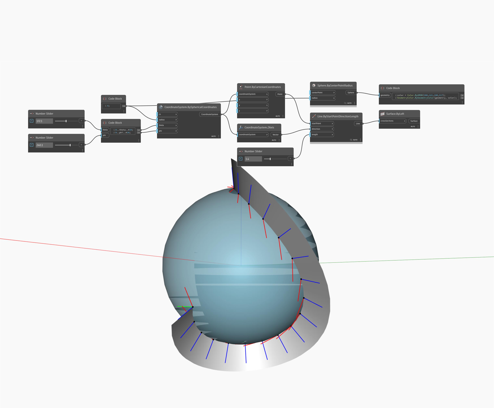

<!--- Autodesk.DesignScript.Geometry.CoordinateSystem.BySphericalCoordinates --->
<!--- UYY33O65ZLXAIX5KFQN2EYDM2O5XLAGJFC4EWEKGUHZDIXLTI5BA --->
## Em profundidade
O nó Point By Spherical Coordinates cria um ponto localizado dentro de um espaço esférico. Aqui, definimos a amarra como Referência cruzada e usamos um intervalo de ângulos phi e theta para gerar uma grade de pontos ao longo de um cilindro com um raio dinâmico. A localização da esfera é definida como um Sistema de coordenadas com a origem (1, 5, 1).
___
## Arquivo de exemplo

