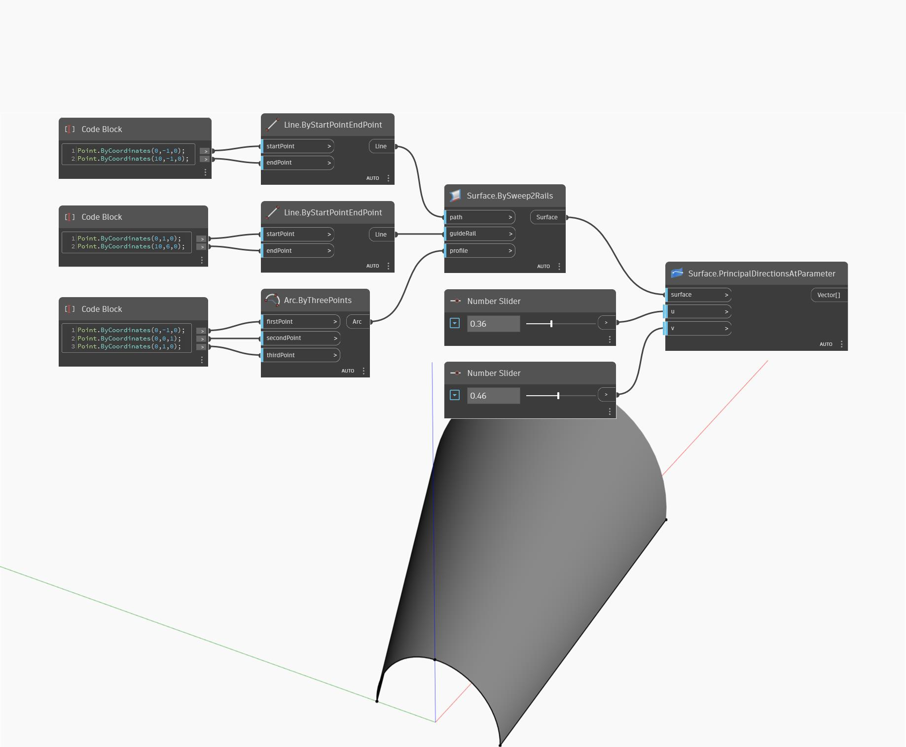

<!--- Autodesk.DesignScript.Geometry.Surface.PrincipalDirectionsAtParameter --->
<!--- VQHTU47YI7VCJWMQZ6UQGNNGBZZD7KX3UZHFGPYMVRITKMY3HB6Q --->
## Em profundidade
Principal Directions at Parameter usa parâmetros de entrada U e V e retorna as curvaturas nas direções U e V. Esse nó retorna uma lista de dois vetores, sendo o primeiro o vetor de direção na direção U e o segundo o vetor de direção na direção V. No exemplo abaixo, primeiro criamos uma superfície usando BySweep2Rails. Em seguida, usamos dois controles deslizantes de número para determinar os parâmetros U e V a fim de localizar as direções usando um nó PrincipalDirectionsAtParameter.
___
## Arquivo de exemplo

