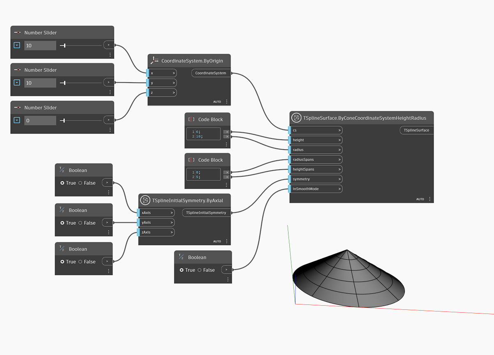

<!--- Autodesk.DesignScript.Geometry.TSpline.TSplineSurface.ByConeCoordinateSystemHeightRadius --->
<!--- WG4273QZLTXFNOZTJWMFHD4JKB67IIQBJCQNC5SMOC43VJNXKACA --->
## In-Depth
No exemplo abaixo, é criado um cone com sua base posicionada na origem do Sistema de coordenadas, definido pela entrada `cs`. O tamanho do cone é definido por `height` e `radius`. Os vãos nas direções radial e de altura são controlados pelas entradas `radiusSpans` e `heightSpans`. A simetria inicial da forma é especificada pela entrada `symmetry`. Se a simetria X ou Y estiver definida como True, o valor dos vãos radiais deverá ser um múltiplo de 4. Por fim, a entrada `inSmoothMode` é usada para alternar entre a visualização do modo suave e de caixa da superfície da T-Spline.

## Arquivo de exemplo

