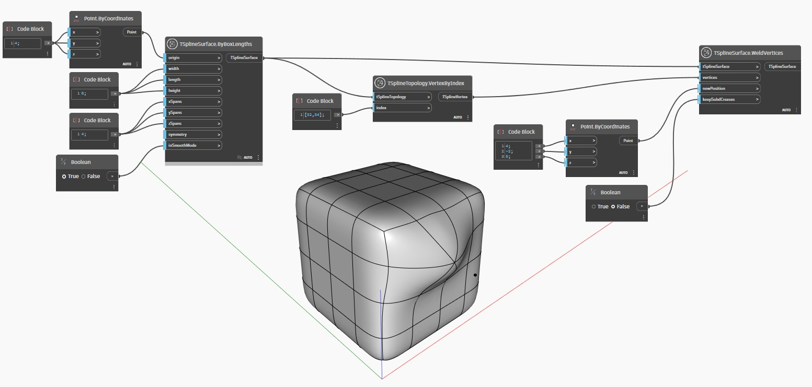

## Em profundidade
No exemplo abaixo, dois vértices de uma superfície de caixa da T-Spline são unidos usando o nó `TSplineSurface.WeldVertices`. Uma nova posição para os vértices soldados é fornecida como entrada `newPosition`. Além disso, a entrada `keepSubdCreases` controla se as arestas ao longo da solda são dobradas.

___
## Arquivo de exemplo

