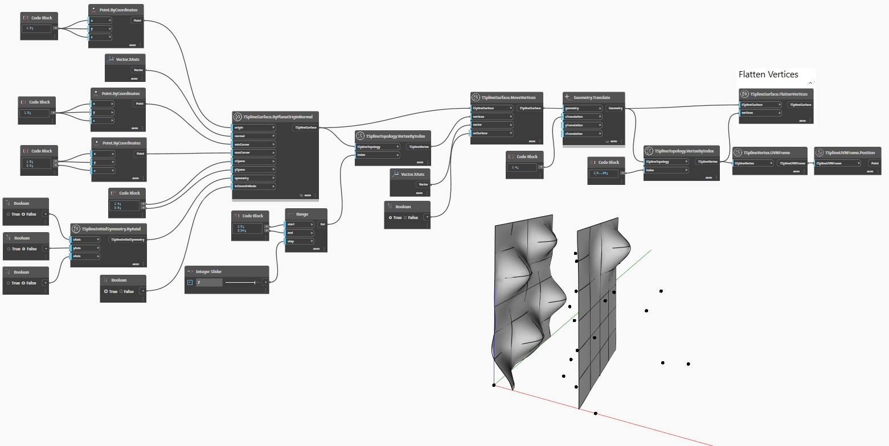

## Em profundidade
No exemplo abaixo, `TSplineTopology.VertexByIndex` é usado para exibir uma lista de vértices em uma superfície da T-Spline plana.
A superfície apresenta vértices de extrusão, alguns dos quais são aplainados usando o nó `TSplineSurface.FlattenVertices(vertices)`.
Os nós `TSplineVertex.UVNFrame` e `TSplineUVNFrame.Position` são usados para realçar os vértices que estão sendo aplainados.
___
## Arquivo de exemplo

