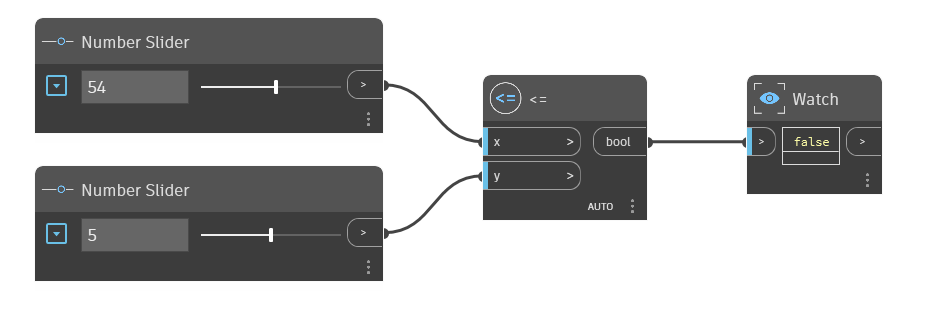

## Em profundidade
O nó `<=` é o operador Menor que ou Igual a. Se a entrada `x` for menor que a entrada `y` ou se os dois valores forem iguais, será retornado True. Se `x` for maior que `y`, esse operador retornará False. No exemplo abaixo, o nó `<=` é usado para determinar se a entrada `x` é menor ou igual à entrada `y`. Usamos dois controles deslizantes de números para controlar as entradas para o operador `<=`.
___
## Arquivo de exemplo

