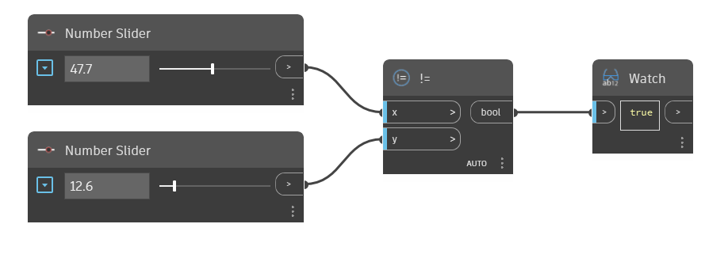

## Подробности
Узел `!=` является оператором Not Equal To. Он принимает два входных значения и возвращает True, если эти значения не равны, и False, если они равны.

В приведенном ниже примере узел `!=` используется для определения того, что два входных значения не равны. Для управления вводом данных для оператора `!=` используются два узла Number Slider.
___
## Файл примера

