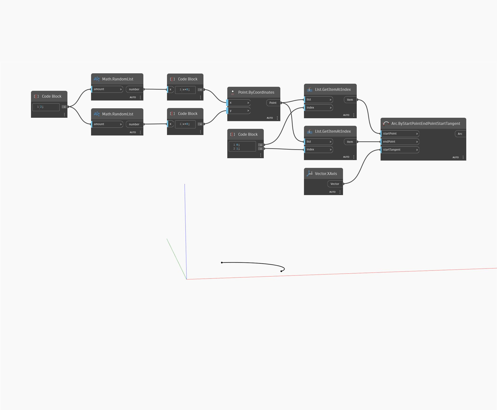

## Подробности
Arc.ByStartPointEndPointStartTangent позволяет построить дугу по двум заданным точкам и любому заданному начальному вектору. В данном примере выполняется построение дуги, которая всегда является касательной к оси X, по двум случайным точкам.
___
## Файл примера

