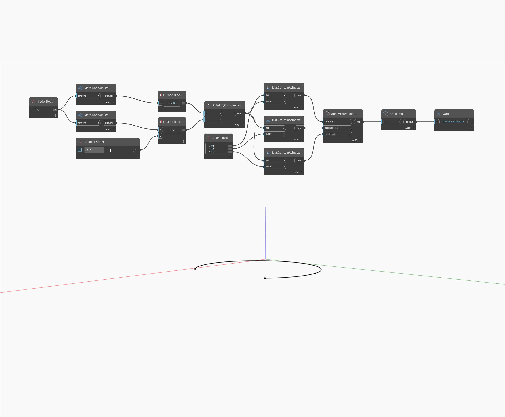

## Подробности
`Arc.Radius` возвращает значение радиуса геометрии дуги.

В примере ниже создается дуга по трем точкам, сгенерированным случайным образом, а затем возвращается точка ее радиуса с помощью узла `Arc.Radius`. Изменение радиуса визуализируется, когда входные точки изменяются в направлении Y.

___
## Файл примера

