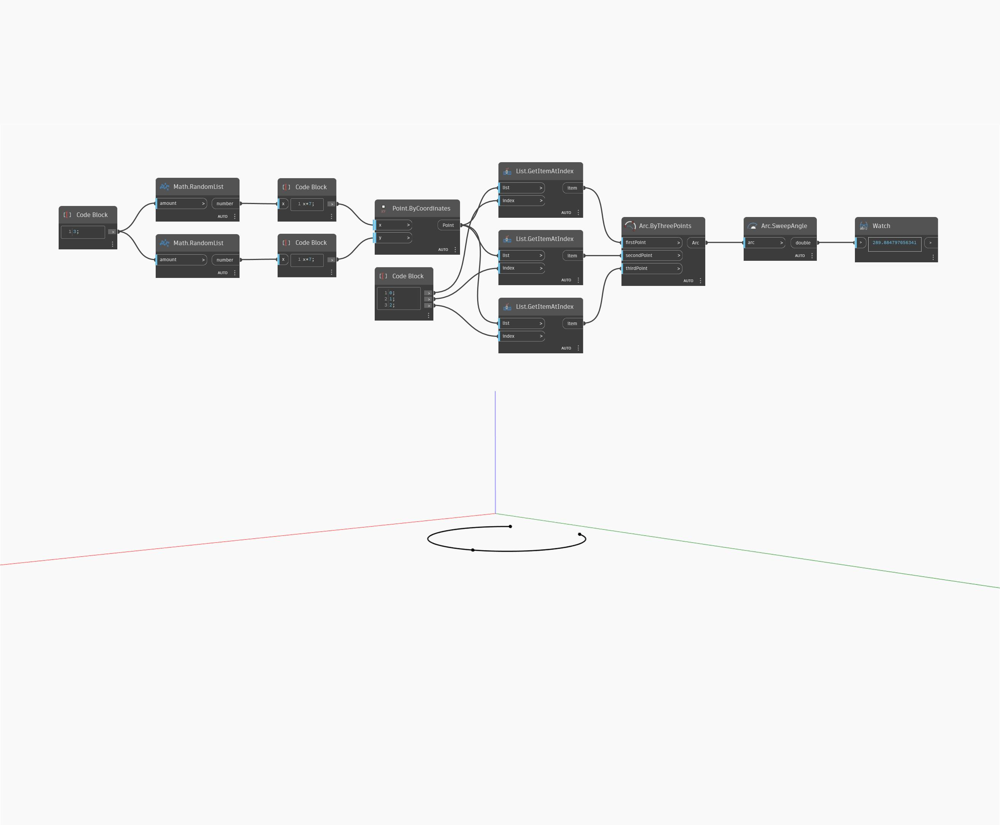

## Подробности
SweepAngle позволяет определить начальный угол дуги эллипса. Он измеряется в градусах против часовой стрелки на плоскости эллипса от начального угла. Конечный угол эллипса равен сумме начального угла и угла сдвига. В примере сначала создается дуга эллипса с помощью плоскости XY и последовательности числовых регуляторов. Затем с помощью функции SweepAngle извлекается длина дуги эллипса.
___
## Файл примера

