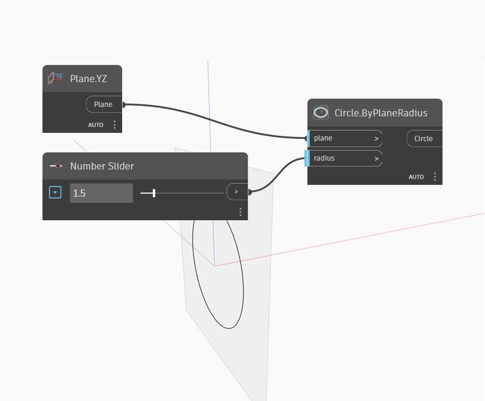

## Подробности
Circle.ByPlaneRadius — это сжатый узел, позволяющий создать окружность любого типа. В данном примере плоскость YZ используется для определения направления окружности, а регулятор Number — для динамического управления ее радиусом.
___
## Файл примера

