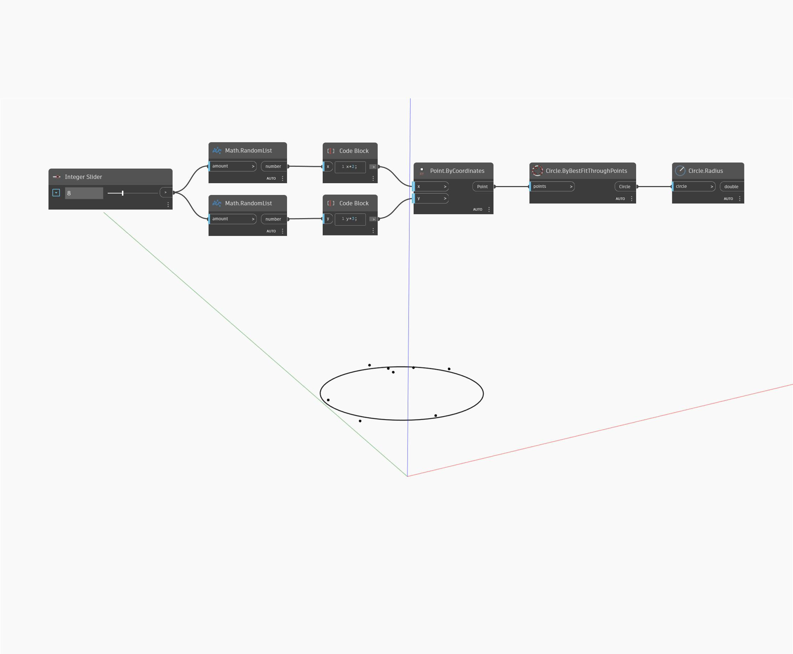

## Подробности
`Circle.Radius` находит радиус заданной окружности.

В примере ниже создается окружность с помощью узла `Circle.ByBestFitThroughPoints`, а затем извлекается радиус окружности.

___
## Файл примера

