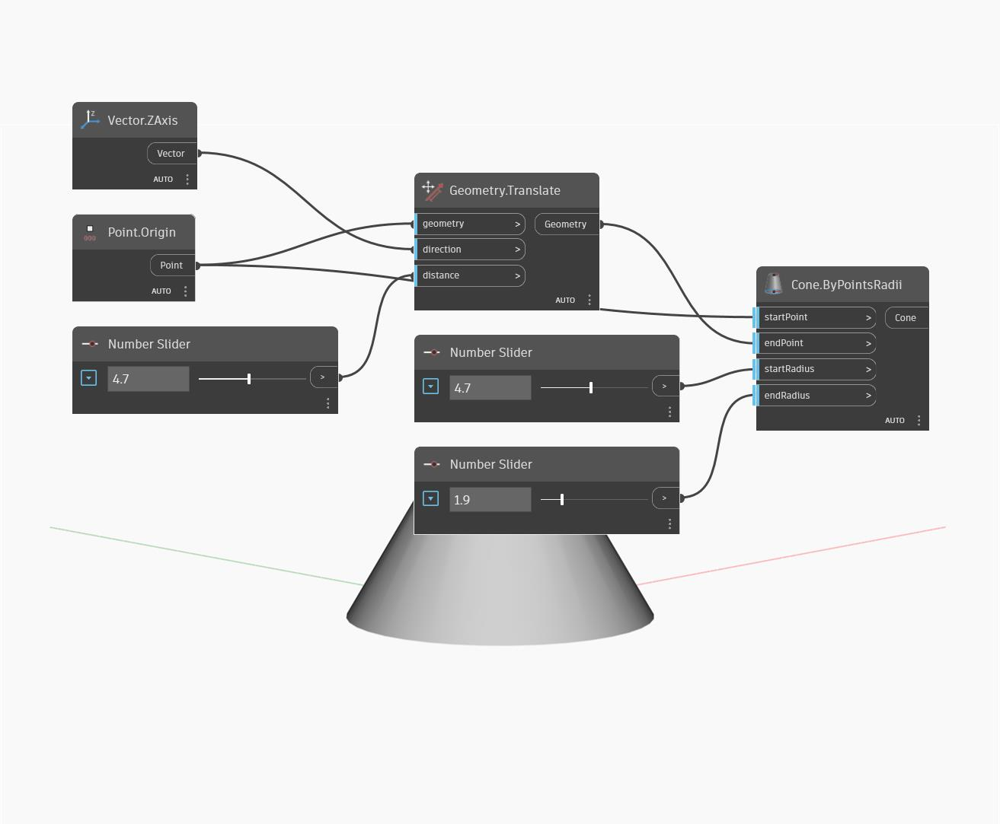

## Подробности
Cone.ByPointsRadii позволяет создать геометрию усеченного конуса по начальной точке, конечной точке и значениям двух радиусов. В данном примере демонстрируется динамический конус, построенный вокруг начала координат МСК с помощью трех числовых регуляторов, контролирующих его высоту и радиус.
___
## Файл примера

