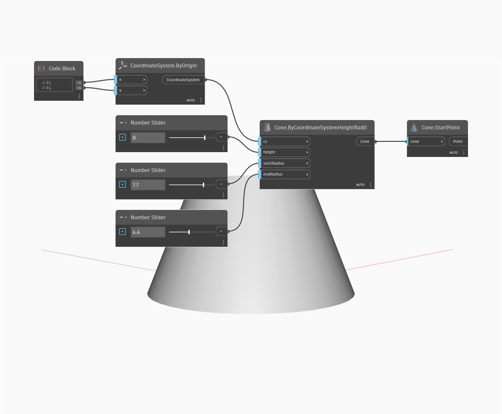

## Подробности
`Cone.StartPoint` находит центр основания конуса.

В примере ниже создается конус путем задания системы координат и двух радиусов. Затем используется узел `Cone.StartPoint`, чтобы найти центр нижней окружности конуса.

___
## Файл примера

