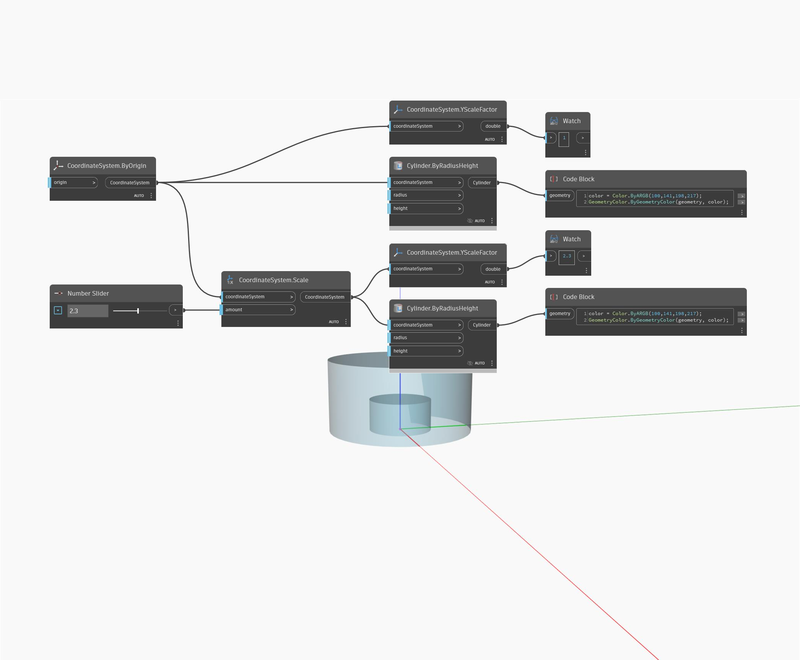

## Подробности
YScaleFactor возвращает число двойной точности, представляющее коэффициент масштабирования по оси Y. В примере ниже цилиндр масштабируется в 2,3 раза, в результате чего возвращается коэффициент масштабирования по оси Y, равный 2,3.
___
## Файл примера

