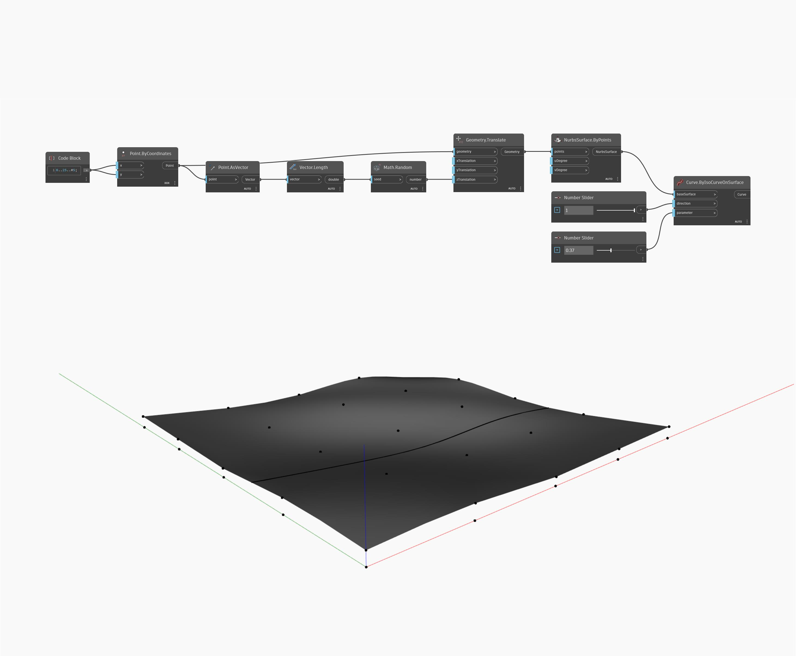

## Подробности
Curve.ByIsoCurveOnSurface позволяет создать кривую, являющуюся изокривой, на поверхности путем задания направления U или V, а также параметра в направлении, противоположном тому, в котором требуется создать кривую. Входной элемент direction определяют направление изокривой, которую требуется создать. Значение 1 соответствует направлению U, а значение 0 — направлению V. В примере ниже сначала создается сетка точек, которые затем переносятся в направлении Z на случайную величину. Эти точки используются для создания поверхности с помощью узла NurbsSurface.ByPoints. Эта поверхность используется в качестве объекта baseSurface узла ByIsoCurveOnSurface. На числовом регуляторе задан диапазон от 0 до 1, а шаг, равный 1, используется для извлечения изокривой в направлении U или V соответственно. Второй регулятор числа используется для определения параметра, при котором извлекается изокривая.
___
## Файл примера

