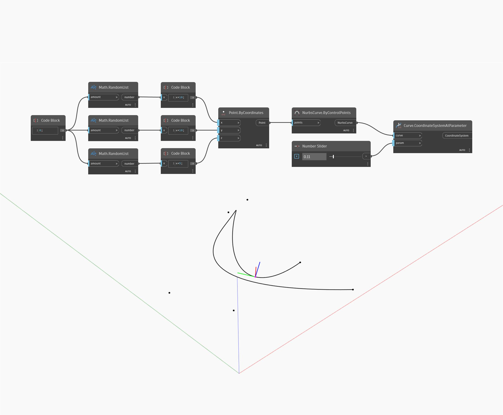

## Подробности
CoordinateSystemAtParameter использует входные параметры U и V и возвращает систему координат. Оси X, Y и Z системы координат определяются направлением нормали, направлением U и направлением V соответственно. В примере ниже сначала создается поверхность с помощью узла BySweep2Rails. Затем с помощью двух числовых регуляторов определяются параметры U и V для создания системы координат с помощью узла CoordnateSystemAtParameter.
___
## Файл примера

