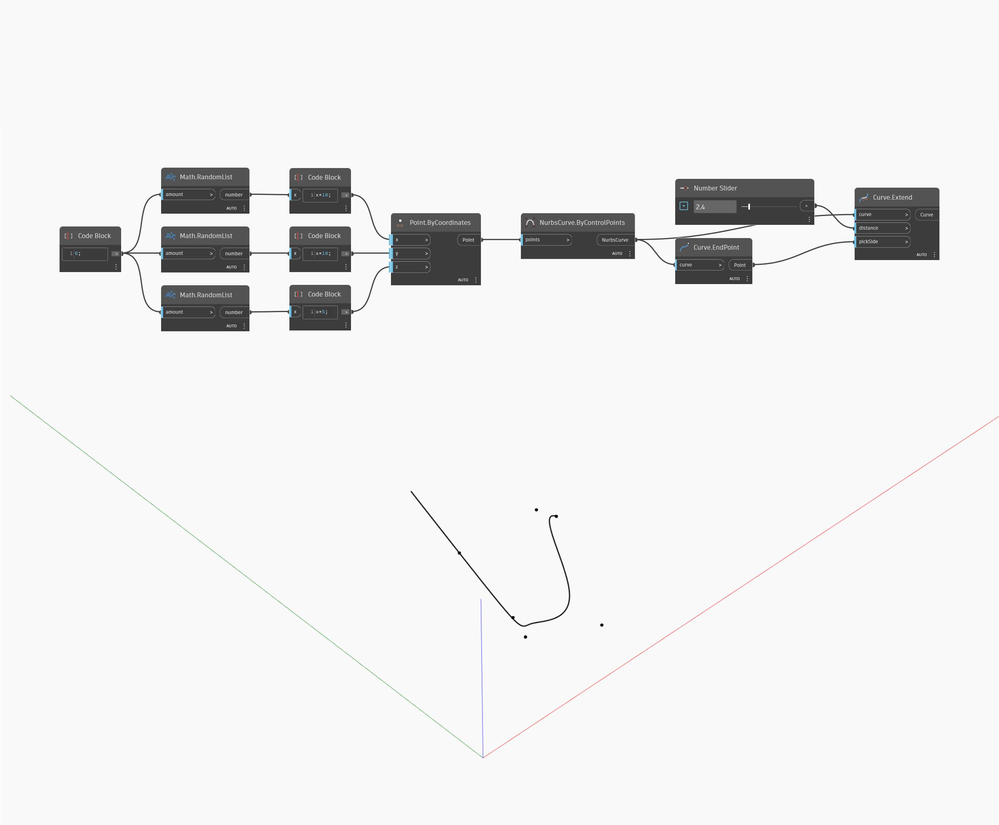

## Подробности
Extend позволяет удлинить входную кривую на заданное входное расстояние. Входной элемент pickSide принимает начальную или конечную точку кривой в качестве входного элемента и определяет, какой конец кривой удлинить. В примере ниже сначала с помощью узла ByControlPoints создается NURBS-кривая, где в качестве входных элементов используется набор случайных точек. Для определения конечной точки кривой, которая будет использоваться в качестве входного элемента pickSide, применяется узел запроса Curve.EndPoint. Числовой регулятор позволяет управлять расстоянием удлинения.
___
## Файл примера

