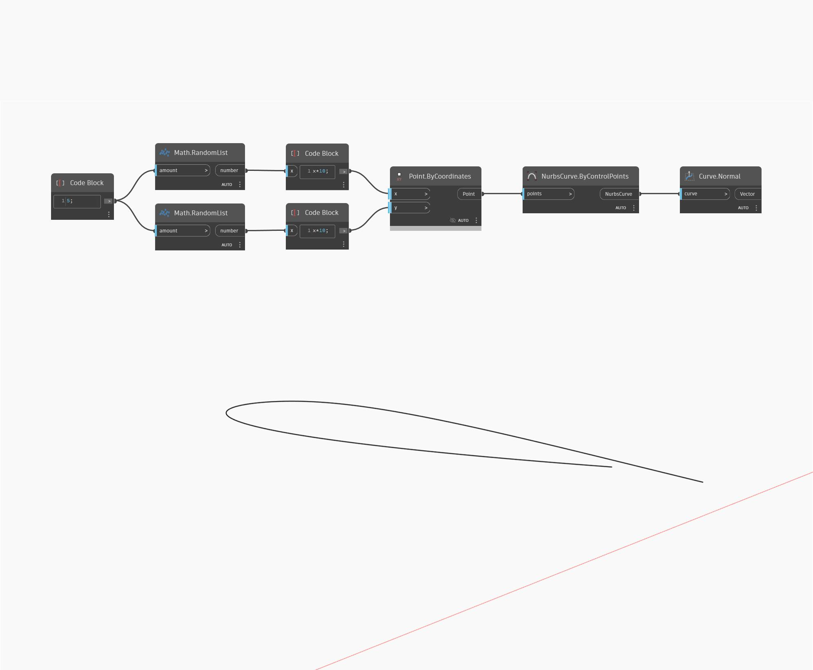

## Подробности
`Curve.Normal` возвращает вектор нормали входной кривой. Кривая должна быть плоской для этого узла.

В примере ниже сначала создается объект NurbsCurve с помощью узла `NurbsCurveByControlPoints`, в качестве входных данных которого используется набор случайно сгенерированных точек. Нормаль этой кривой определяется с помощью узла `Curve.Normal`.

___
## Файл примера

