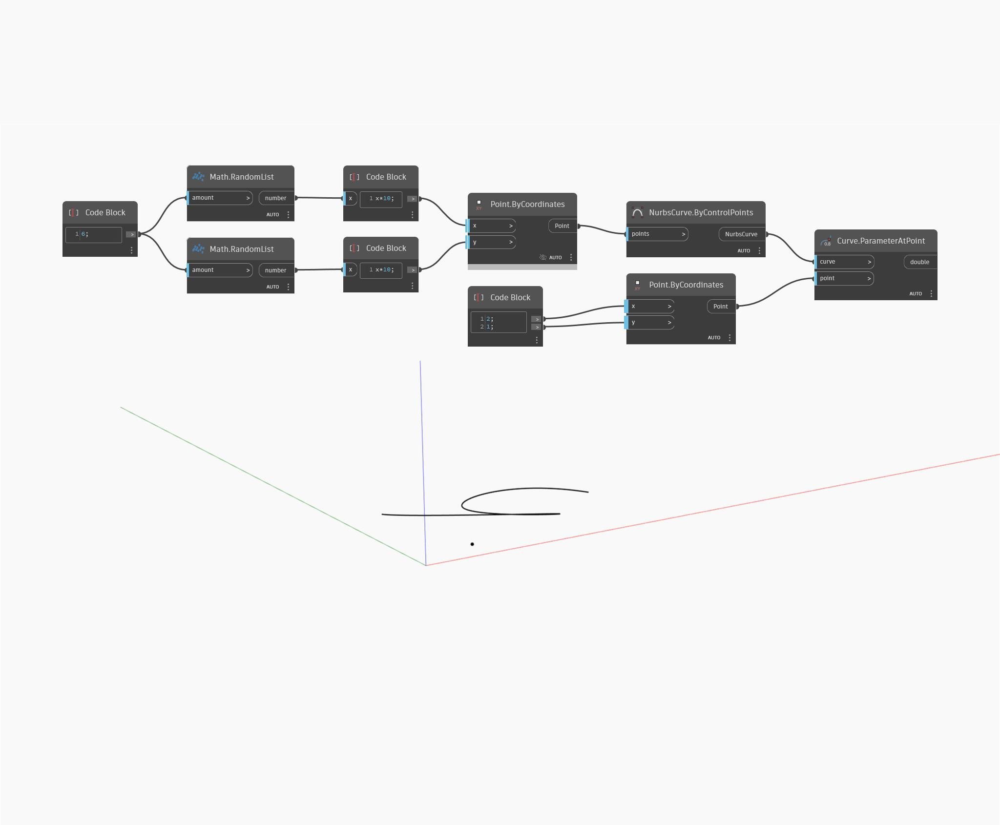

## Подробности
ParameterAtPoint возвращает значение параметра заданной точки вдоль кривой. Если входная точка ввода находится не на кривой, ParameterAtPoint возвращает параметр точки на кривой, ближайшей к входной точке. В примере ниже сначала с помощью узла ByControlPoints создается NURBS-кривая, где в качестве входных элементов используется набор случайных точек. С помощью Code Block создается дополнительная отдельная точка для задания координат X и Y. Узел ParameterAtPoint возвращает параметр вдоль кривой в точке, ближайшей к входной точке.
___
## Файл примера

